# Chart Patterns & Trade Plans — The Daily Price Action + Volume Playbook

> **This is a picture-first manual.** Every pattern is shown as a chart with **Entry, Stop, Trigger, Targets (T1/T2), Trail line, and Max-gain logic** marked directly on the visual. Read the pictures first; the bullets are just reinforcement.

## The Pattern Collector's Mistake

Every beginner trader makes the same mistake.

They download a 200 candle chart with 15 indicators. They draw trendlines. They label Bull Flags and Pennants and Cup-and-Handles. They see patterns everywhere.

And then they trade them.

Half the patterns don't work. The ones that "work" only go their direction for two days before reversing. They're constantly caught on the wrong side of moves, blaming the chart for "breaking" the pattern.

Here's the truth: **The pattern isn't broken. The trade plan is.**

Most traders confuse **pattern recognition** with **trade execution**. They're not the same thing.

A beautiful pattern without an entry plan, a defined stop, a defined risk size, a defined invalidation level, and actual probability analysis is not a setup.

**It's a drawing.**

> *"Price is the final opinion. Volume is the footprint behind it."*

This guide is not for pattern collectors. It's for traders who understand that **a pattern is just the first half of the work.** The second half — turning that pattern into a disciplined trade plan — is where the real money lives.

### What This Guide Actually Is

This is a **daily-use execution manual**. Not a pattern encyclopedia. Not a museum of chart shapes.

Before market open, you're going to spend 10 minutes reading one pattern type and one failure pattern. Then you'll mark your watchlist for stocks matching those behaviors. Then you'll trade them — if and only if all the conditions line up.

The goal is not to memorize 50 patterns or become a pattern expert.

**The goal is to understand:**
- What is price actually telling you?
- Where are institutions likely accumulating or distributing?
- What should volume be doing?
- Where does the entry belong?
- Where does the stop belong?
- When is the setup invalid?
- When should you do nothing?

---

## How To Read Every Chart In This Guide

Every annotated chart uses the same legend so you can read it in seconds:

| Color | Meaning |
|---|---|
| 🟢 **Green dashed line** | **Entry** — the actual trigger price |
| 🔴 **Red dashed line** | **Stop** — invalidation. If price closes here, the trade is wrong. |
| 🔵 **Light blue dashed line** | **Target 1 (T1)** — first profit-take, usually +2R |
| 🔷 **Blue dashed line** | **Target 2 / Max-gain projection** — measured move or trail target |
| 🟠 **Amber dashed line** | **Trail line** — moving stop after T1 (under higher lows or 10/21 EMA) |
| 🟡 **Yellow** | **Pivot / key level** (resistance, neckline, base top) |
| **Volume bars** | Green = up-day volume, dark red = down-day volume |

**Read order on every chart:**
1. Where is the **trigger** (entry)?
2. Where is the **stop** (invalidation)?
3. What does **volume** need to do at the trigger?
4. Where do **T1 and T2/max** fall — is reward worth the risk?
5. How will you **trail** after T1?

---

## 1. The Core Rule: Pattern First, Trade Plan Second

A beautiful pattern without:
- a defined trigger,
- a defined stop,
- a defined risk size,
- a defined invalidation,
- and a defined target logic,

is not a setup.
It is only a drawing.

Every pattern in this guide should be read through five questions:

1. **What is price doing?**
2. **What is volume doing?**
3. **Where is the actual trigger?**
4. **Where is the trade wrong?**
5. **Is the reward worth the risk?**

If you cannot answer all five, you are not ready to trade it.

---

## 2. Reading Price Action Like You're Reading a Story

### Stock strength on the chart
Higher highs, higher lows. Closes near highs. Shallow, fast pullbacks. Red days quickly recovered. Price respects short-term moving averages and pivots.
**Meaning:** institutions are still accumulating. Path of least resistance is up.

### Stock weakness on the chart
Lower highs after breakout attempts. Wide-range red candles near support. Repeated rejection from resistance. Closes in the lower half of range. Bounces on weak volume.
**Meaning:** institutions are leaving. Path of least resistance is down or sideways.

### Why tightness before a breakout matters
Tight trading (small candles, narrow range) usually means **supply has dried up**. Weak holders are gone. Institutions are not rushing to sell. The next move can expand quickly once demand arrives. **When you see the range coiling tighter and tighter, your radar should light up.**

---

## 3. Reading Volume: The Institutional Fingerprints

### Healthy volume
Volume dries up during the base/pullback. Volume explodes on bullish breakouts. Down-volume stays lower than up-volume. Support bounces with rising participation.
**Meaning:** the smart money is backing the move.

### Dangerous volume — skip the trade
Breakout on weak volume. Pullbacks on rising heavy volume. Price up but volume shrinking. Repeated heavy red candles inside the base. Failed breakout followed by the largest volume bar in the entire pattern.
**Meaning:** retail enthusiasm or institutional dumping. Stand aside.

### The classic accumulation signature
1. **Quiet pullback volume** during consolidation.
2. **Tight price structure** as volatility contracts.
3. **Aggressive expansion on breakout.**

When you see this sequence, you've found a pattern worth trading.

---

## 4. Universal Pattern Checklist

Before taking any pattern:

- [ ] Is the broader market supportive?
- [ ] Is the stock in a Stage 2 / primary uptrend if going long?
- [ ] Is relative strength strong?
- [ ] Is the pattern clean and obvious, not forced?
- [ ] Has volume contracted during the setup?
- [ ] Is there a clear breakout / trigger point?
- [ ] Is the stop placement logical and tight enough?
- [ ] Is risk-reward at least acceptable (≥ 2R to T1, ≥ 3R to max)?
- [ ] Am I buying early strength or chasing extension?
- [ ] If this fails, will I exit without hesitation?

If three or more answers are weak, skip the trade.

---

## 5. Continuation Patterns — The Money Patterns

These patterns work best when the stock is already strong.

### 5.1 Bull Flag

**Structure:** strong impulse (the pole), short pullback or sideways drift (the flag), continuation through flag high.

#### Structure visual

#### Trade plan — Entry, Stop, Targets, Trail, Max gain
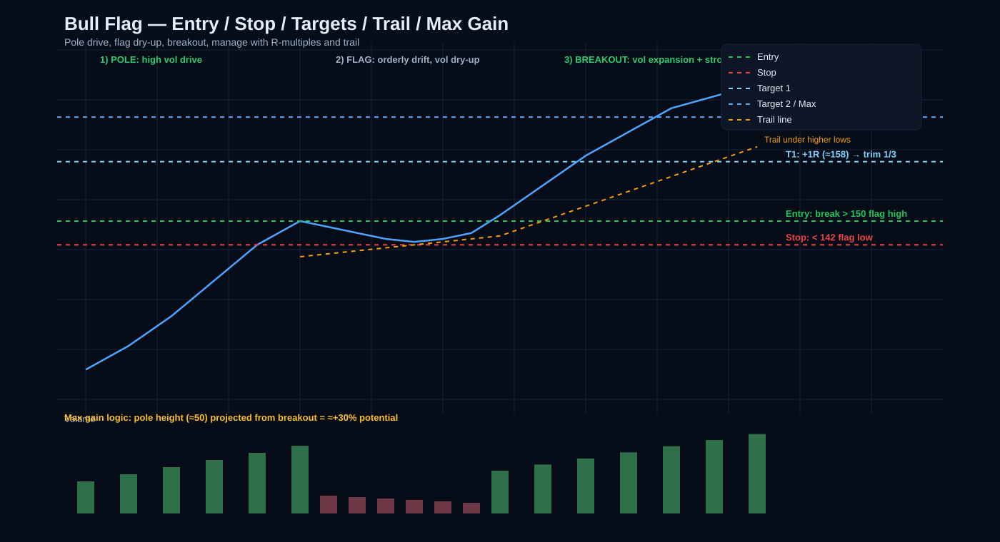

- **Entry:** break above flag high on volume expansion.
- **Stop:** below flag low (or last tight pivot inside the flag).
- **Trigger:** strong-close breakout candle with volume above the flag-day average.
- **T1:** prior swing extension or +2R — trim 1/3.
- **T2 / max gain:** pole height projected from breakout (typical max +20–35%).
- **Trail:** under each new higher low; under the 10/21 EMA once trend resumes.
- **Invalidate:** heavy-volume breakdown through flag low; breakout fails and closes back inside flag.

#### Variations — which to take, which to skip
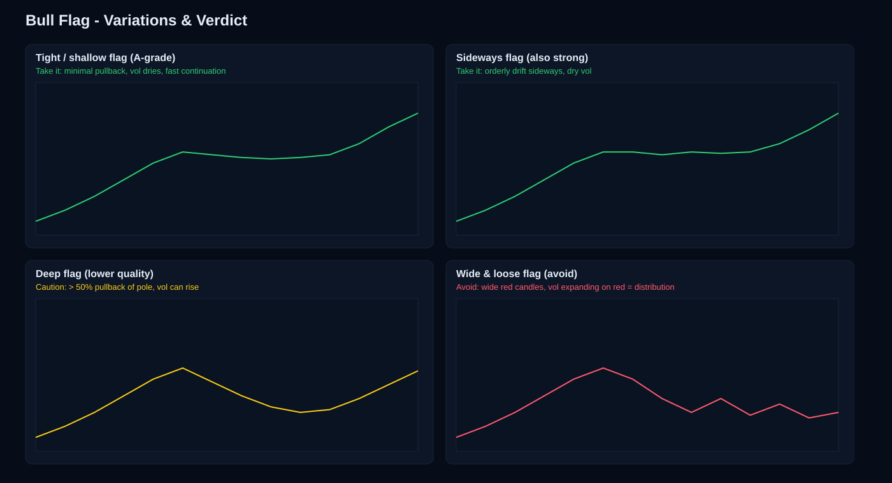

- **Tight / shallow flag** — strongest. Take it.
- **Sideways flag with dry volume** — also strong. Take it.
- **Deep flag (> 50% pullback of pole)** — lower quality. Caution.
- **Wide & loose flag with rising sell volume** — distribution. Avoid.

---

### 5.2 Pennant / Symmetrical Triangle

**Structure:** sharp impulse, then converging trendlines (lower highs + higher lows) into a tight coil.

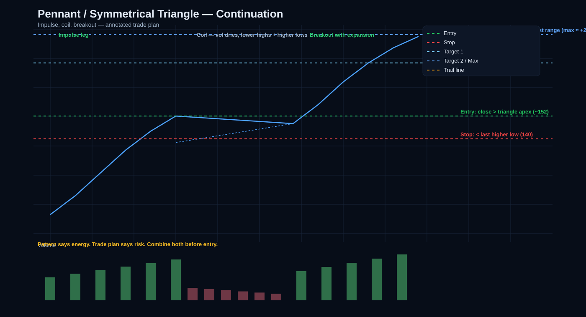

- **Entry:** decisive close above the upper boundary / triangle apex.
- **Stop:** below the last higher low inside the triangle.
- **Trigger:** breakout candle expands range with visible volume vs the coil days.
- **T1:** prior impulse extension or +2R.
- **T2 / max gain:** measured move from the widest part of the triangle (typical max +20–28%).
- **Trail:** under higher lows once trend resumes.
- **Invalidate:** breakout fails to follow through within 1–2 sessions, or the lower boundary breaks on heavy volume.

#### Variations — which to take, which to skip
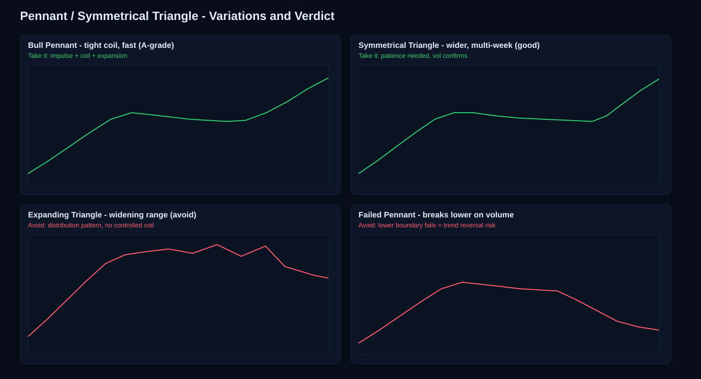

- **Bull pennant (tight, fast coil)** — strongest. Take it.
- **Symmetrical triangle (wider, multi-week)** — take it with patience.
- **Expanding triangle (widening range)** — distribution risk. Avoid.
- **Lower boundary breaks on volume** — setup failed. Avoid.

---

### 5.3 Ascending Triangle

**Structure:** flat resistance overhead, rising lows underneath. Sellers keep defending one level while buyers raise the floor.

#### Structure visual

#### Trade plan
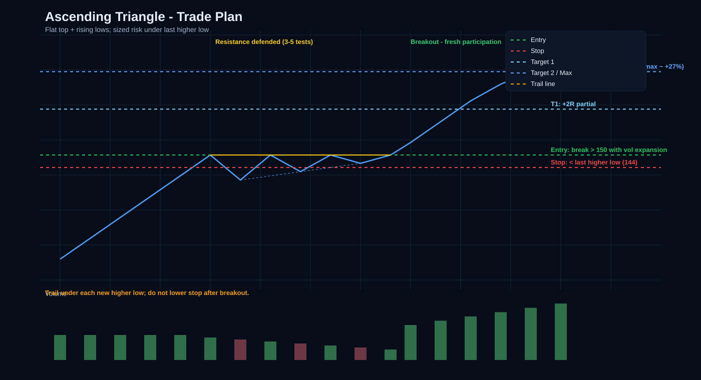

- **Entry:** breakout above horizontal resistance with volume expansion.
- **Stop:** below the last rising swing low.
- **Trigger:** wide-range breakout candle that closes near its high.
- **T1:** +2R or first prior resistance.
- **T2 / max gain:** triangle height projected upward (typical max +20–27%).
- **Trail:** under each new higher low, never lower the original stop after entry.
- **Invalidate:** decisive break below the rising trendline; multiple failed breakout attempts on heavy upper wicks.

#### Variations
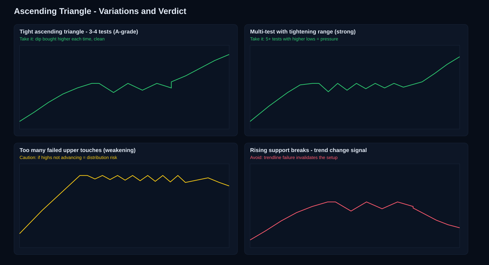

- **Tight 3-4 test ascending triangle** — strongest. Take it.
- **Multi-test with tightening higher lows** — also strong. Take it.
- **Too many failed upper touches** — resistance absorbing demand. Caution.
- **Rising support breaks on volume** — setup invalidated. Avoid.

---

### 5.4 High Tight Flag (HTF)

**Structure:** near-vertical move (often +90–100% in weeks), followed by a tight, shallow rest. One of the rarest and most explosive setups.

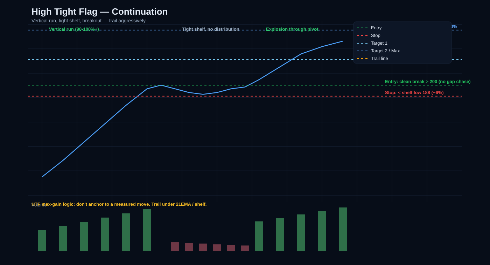

- **Entry:** clean break of flag high (no gap chase).
- **Stop:** below the lower end of the flag (~3–6% from entry); if more than that, skip — the math doesn't work.
- **Trigger:** breakout day prints fresh institutional volume above flag-day averages.
- **T1:** +2R partial.
- **T2 / max gain:** **don't anchor to a measured move** — HTFs can run +50–100% if regime supports. Trail under 10/21 EMA.
- **Invalidate:** breakdown through flag low; wide sloppy ranges or red volume spikes inside the flag.

#### Variations
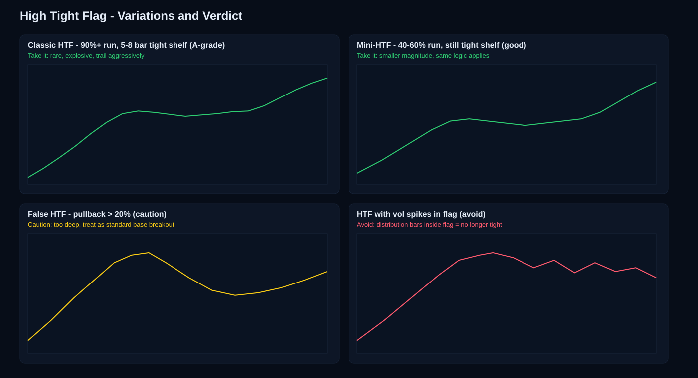

- **Classic HTF (90%+ run, tight 5-8 bar shelf)** — rarest and most explosive. Take it.
- **Mini-HTF (40-60% run, still tight)** — valid with same logic. Take it.
- **False HTF (pullback > 20%)** — too deep; treat it as a standard base. Caution.
- **HTF with volume spikes on red flag bars** — distribution inside flag. Avoid.

---

## 6. Base Patterns — Structured Breakout Setups

These are the patterns most traders should specialize in.

### 6.1 Cup with Handle

**Structure:** rounded U-shaped base, then a short, calm handle in the upper half/third of the cup.

#### Structure visual

#### Trade plan
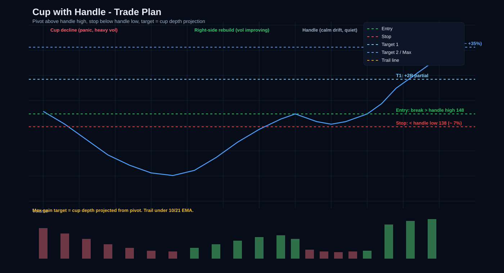

- **Entry:** above the handle high / pivot.
- **Stop:** below the handle low (or below breakout candle low if very tight).
- **Trigger:** wide bullish breakout candle, close near high, volume well above handle-day average.
- **T1:** +2R partial.
- **T2 / max gain:** cup depth projected up from the pivot (typical max +25–40%).
- **Trail:** under 10/21 EMA after breakout, or under each higher low for swing trades.
- **Invalidate:** handle breaks down on volume; breakout fails and closes back below pivot.

#### Variations
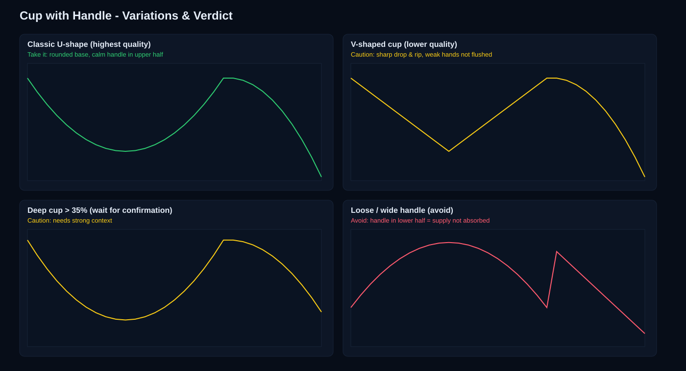

- **Classic U-shape with calm handle** — highest quality.
- **V-shaped cup** — sharp drop and rip; weak hands not flushed. Caution.
- **Deep cup (> 35%)** — only with very strong context. Caution.
- **Loose / wide handle in lower half** — supply not absorbed. Avoid.

---

### 6.2 Flat Base

**Structure:** shallow sideways consolidation after a prior advance, typically 4–6 weeks of tight range.

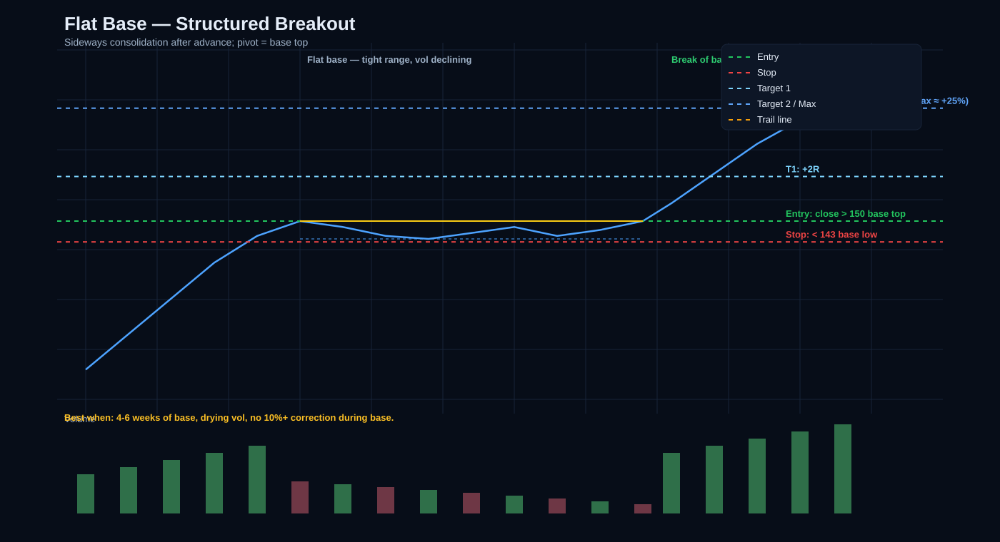

- **Entry:** close above the flat top / pivot.
- **Stop:** below the lower end of the base.
- **Trigger:** wide breakout candle with volume that visibly stands out vs base-day volume.
- **T1:** +2R or prior swing high.
- **T2 / max gain:** continuation of prior impulse (typical max +20–25%).
- **Trail:** under most recent support pivot or 21 EMA.
- **Invalidate:** deep crack through the base, failed breakout on volume, multiple distribution upper-wicks during base.

#### Variations
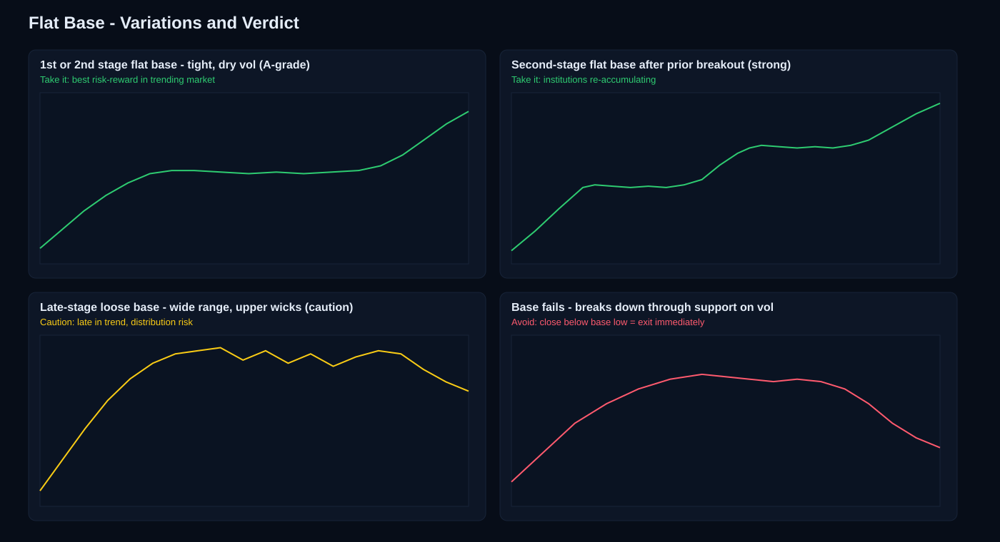

- **1st or 2nd stage flat base — tight, dry volume** — highest quality. Take it.
- **Second-stage base after prior breakout and run** — institutions re-accumulating. Take it.
- **Late-stage loose base with upper wicks** — distribution risk. Caution.
- **Base breaks down through support on volume** — exit immediately. Avoid.

---

### 6.3 Double Bottom

**Structure:** W-shape where the second low often undercuts the first to shake out weak hands, then snaps back through the midpoint pivot.

#### Structure visual

#### Trade plan
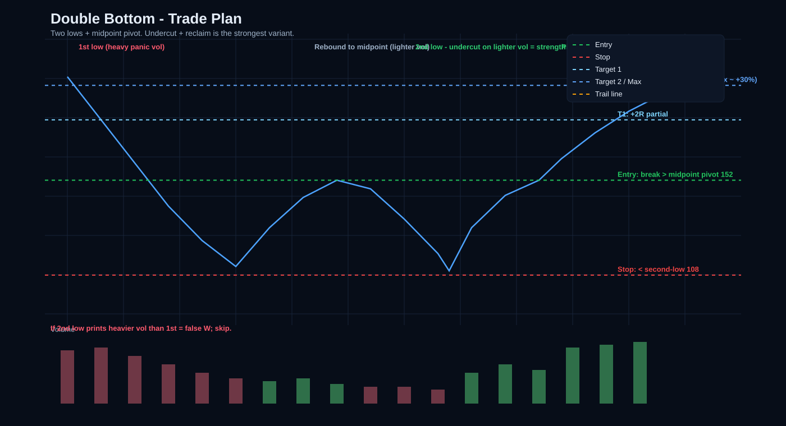

- **Entry:** break of midpoint pivot.
- **Stop:** below second low.
- **Trigger:** breakout candle through midpoint with volume expansion vs the rebound leg.
- **T1:** +2R partial.
- **T2 / max gain:** base height projected from midpoint (typical max +20–35%).
- **Trail:** under higher lows after the breakout.
- **Invalidate:** second low keeps breaking without reclaim; midpoint breakout fails immediately.

#### Variations
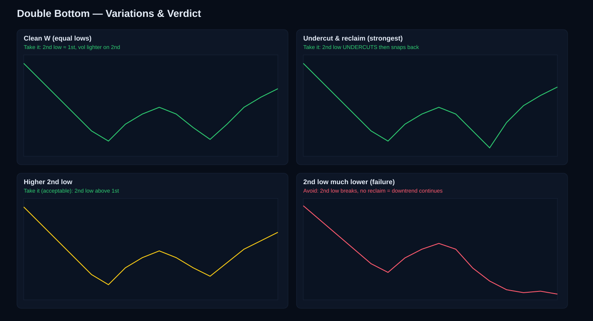

- **Clean W (equal lows)** — strongest.
- **Undercut & reclaim** — most powerful variant; trap energy fuels the move.
- **Higher second low** — acceptable.
- **Second low much lower with no reclaim** — failure. Avoid.

---

### 6.4 Volatility Contraction Pattern (VCP)

**Structure:** a series of pullbacks where each contraction is smaller than the previous one (e.g., 12% → 8% → 4%) while volume dries up.

#### Structure visual

#### Trade plan with contraction markers
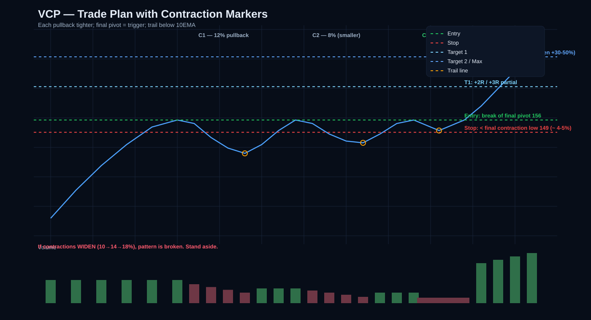

- **Entry:** break of pivot above the **final tight contraction**.
- **Stop:** below final contraction low (typically 4–7% risk).
- **Trigger:** breakout candle expands sharply on urgent volume.
- **T1:** +2R / +3R partial.
- **T2 / max gain:** trail aggressively — VCPs commonly run +30–50% in trending regimes.
- **Trail:** under 10 EMA on daily; under 21 EMA on weekly.
- **Invalidate:** contractions widen instead of tighten; volume expands on downside inside the pattern.

#### Variations
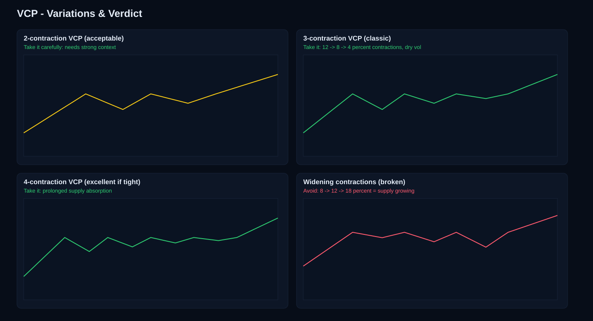

- **2-contraction VCP** — acceptable in strong context.
- **3-contraction VCP** — classic, highest probability.
- **4-contraction VCP** — excellent if still tight.
- **Widening contractions** — broken pattern. Avoid.

---

## 7. Reversal Patterns — Trade Smaller, Trade Cleaner

Reversal patterns can work well, but they demand more patience and selectivity.

### 7.1 Inverse Head & Shoulders

**Structure:** three troughs — left shoulder, deeper head (capitulation), higher right shoulder — with a flat neckline as the trigger.

#### Structure visual

#### Trade plan
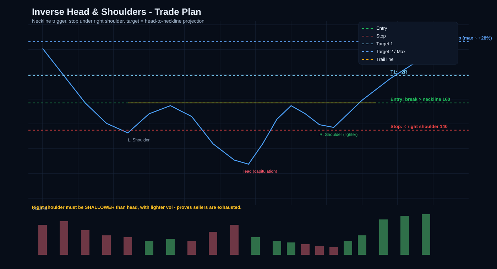

- **Entry:** break above the neckline (or constructive retest hold).
- **Stop:** below the right shoulder low.
- **Trigger:** breakout candle with strong close + volume expansion vs the right-shoulder days.
- **T1:** +2R partial.
- **T2 / max gain:** head-to-neckline distance projected upward (typical max +20–30%).
- **Trail:** under 21 EMA or each higher low.
- **Invalidate:** neckline breakout fails immediately; right shoulder breaks down before neckline triggers.

#### Variations
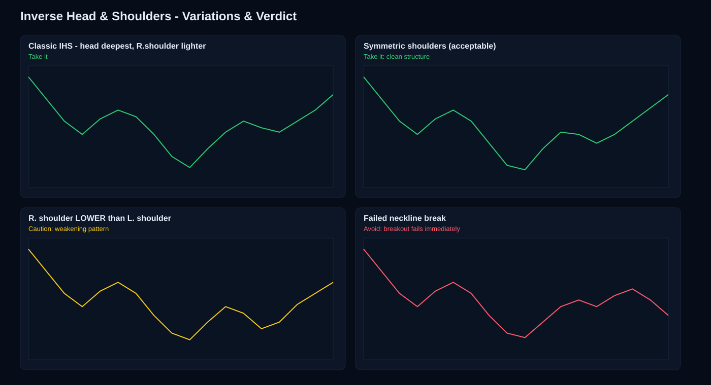

- **Classic IHS** — head deepest, right shoulder lighter and shallower. Take it.
- **Symmetric shoulders** — acceptable.
- **Right shoulder lower than left shoulder** — pattern weakening. Caution.
- **Failed neckline break** — avoid; structure is broken.

---

### 7.2 Rounding Bottom / Saucer

**Structure:** slow, multi-week U-shape transitioning from decline to accumulation to breakout. No violent rejection at the lows.

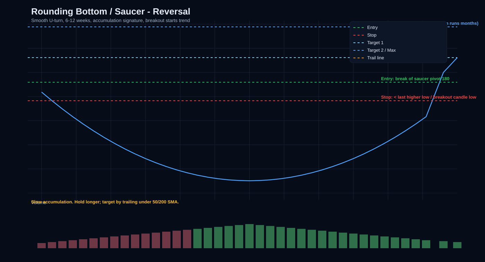

- **Entry:** break of saucer pivot, or the first constructive pullback after breakout.
- **Stop:** below the breakout candle low or last higher low.
- **Trigger:** breakout candle with volume that finally expands after weeks of dry volume.
- **T1:** +2R partial.
- **T2 / max gain:** depth of saucer projected upward; these often start **multi-month trends**, so consider trailing rather than capping targets.
- **Trail:** under 50/200 SMA for position trades.
- **Invalidate:** breakout fails and price sinks back into the base; structure is too erratic.

#### Variations
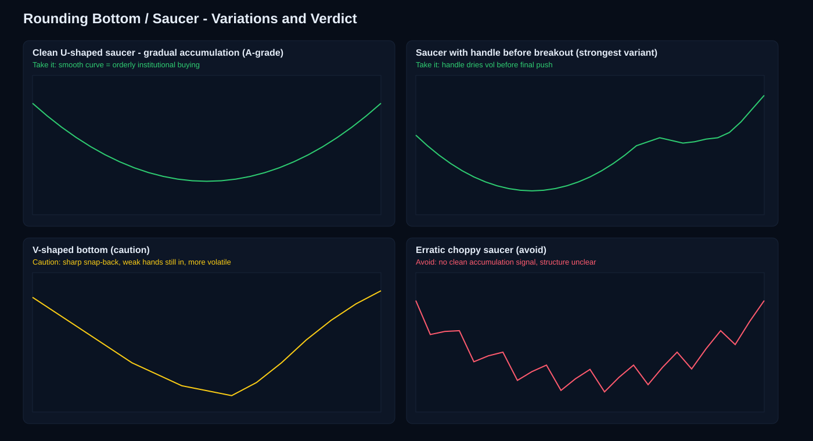

- **Clean U-shaped saucer — smooth gradual accumulation** — strongest. Take it.
- **Saucer with handle before breakout** — most powerful variant; handle dries vol. Take it.
- **V-shaped bottom (sharp snap-back)** — weak hands still in, more volatile. Caution.
- **Erratic choppy saucer — no clean structure** — no institutional signature. Avoid.

---

### 7.3 Failed Breakdown / Undercut & Reclaim

**Structure:** price breaks support, traps weak holders and shorts, then snaps back above the level on the same session or next day.

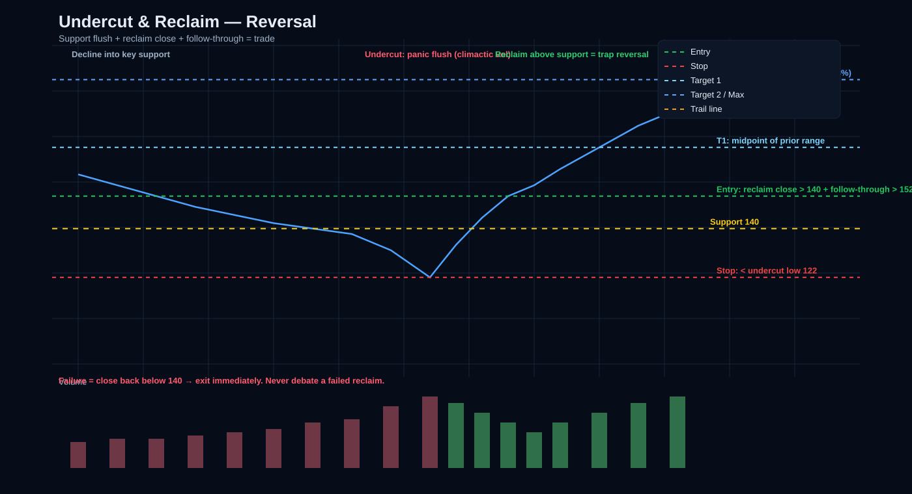

- **Entry:** reclaim close back above support, with follow-through above the reclaim candle high.
- **Stop:** below the undercut low.
- **Trigger:** climactic volume at the undercut, then visibly higher relative volume on the reclaim.
- **T1:** midpoint of prior range.
- **T2 / max gain:** prior resistance (typical max +20–30%).
- **Trail:** under reclaim low first, then under each higher low.
- **Invalidate:** **reclaim fails — close back below the reclaimed level → exit immediately.** Never debate a failed reclaim.

#### Variations
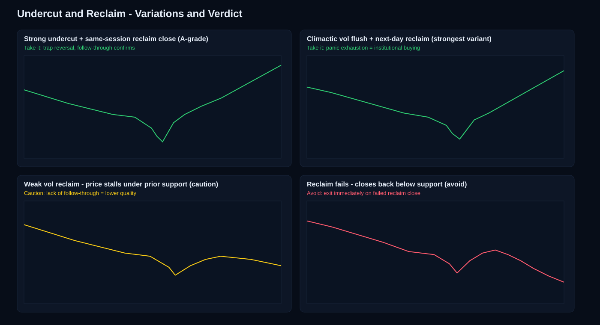

- **Strong undercut + same-session reclaim close** — strongest. Take it.
- **Climactic vol flush + next-day reclaim with follow-through** — most powerful variant. Take it.
- **Weak-volume reclaim, price stalls under prior support** — lower quality. Caution.
- **Reclaim closes back below support next session** — failed. Exit immediately. Avoid.

---

## 8. Intraday Patterns Worth Keeping Simple

For daily review, these are enough. Apply the same Entry / Stop / Trigger / Targets / Trail discipline.

- **Opening Range Breakout (ORB)** — define the first 5/15/30-minute range, trade break with volume + market alignment, best on gap + news + RS names.
- **First Pullback After Breakout** — initial burst is followed by a clean pullback to VWAP / 9 EMA / pivot; entry on bounce confirmation.
- **Inside Bar Break** — small compression after an impulse; break of inside-bar high or low gives low-risk continuation or reversal trigger.

---

## 9. Pattern Failure Drills — What to Avoid

Failed patterns matter as much as winning ones. **Reading failure prevents 80% of bad trades.**

### 9.1 Failure A — Weak-Volume Breakout Failure

- **Tell:** breakout candle closes off highs, next day inside or down close. Breakout volume **below** pattern average.
- **Action now:** exit on close back below pivot; do not add.
- **Re-entry:** only after a new tight base with real volume.
- **Avoid:** averaging down while price stays under failed pivot.

### 9.2 Failure B — Late-Stage Extended Breakout Trap

- **Tell:** wide green candle into resistance after multi-leg run; long upper wick; high volume but poor close (distribution risk).
- **Action now:** skip the chase; protect open gains.
- **Re-entry:** first tight pullback to support with calm volume.
- **Avoid:** fresh buys 4–8% extended above the pivot into resistance.

### 9.3 Failure C — Undercut Reclaim That Fails

- **Tell:** reclaim candle prints, then next session closes back below the reclaimed level. Reclaim has no follow-through.
- **Action now:** close position on the failed reclaim close.
- **Re-entry:** only after a second valid reclaim plus follow-through.
- **Avoid:** holding because of the first reclaim narrative.

---

## 10. Trade Plan Templates by Pattern

Use this exact structure. Every plan should match a chart in this guide.

### Template A — Breakout Trade
- **Pattern:**
- **Trend context:**
- **Pivot / trigger:**
- **Entry price:**
- **Stop location:**
- **Risk per share:**
- **Position size:**
- **First target (T1, +2R):**
- **Main target / max-gain logic (T2):**
- **Trail rule:**
- **Invalidation condition:**
- **What volume must do:**

### Template B — Pullback Trade
- **Pattern that broke out from:**
- **Pullback level:**
- **What confirms support:**
- **Bounce trigger:**
- **Stop:**
- **Target:**
- **Trail rule:**
- **Invalidation:**

### Template C — Reversal Trade
- **Major level being defended:**
- **What shows sellers are exhausted:**
- **What confirms reclaim:**
- **Entry:**
- **Stop:**
- **T1 / T2:**
- **Trail rule:**
- **Why this is not just a random bounce:**

---

## 11. Daily Pattern Review Routine

### Before market open
Mark watchlist names matching:
- bull flags after strong earnings moves
- tight handles
- VCP-like contractions (3+ contractions, drying volume)
- clean support retests / undercut-reclaim setups
- relative strength leaders

### During market hours
Focus only on:
- price at level
- volume vs average
- quality of breakout candle
- whether the setup is extending too far from risk

### After market close
Score:
- which breakouts worked
- which failed
- whether volume confirmed
- whether your entry was early, clean, or emotional
- whether you respected the actual trade plan

---

## 12. The Daily "No Trade" List

Do **not** trade the pattern when:
- the market is weak and the stock is fighting alone,
- volume is missing,
- the entry is too extended (4–8% above the pivot),
- stop placement is too wide (R-multiple to T1 below 2),
- structure is loose and obvious in a bad way,
- you are emotionally urgent,
- the pattern looks pretty but the plan is weak.

Beautiful charts do not pay. Well-executed trade plans do.

---

## 13. Visual Comparison — A-Grade vs Failure (60-second pre-trade filter)

Use these picture-first comparisons as the final filter before entry.

### Continuation: take the tight setup, skip the weak breakout

| A-grade continuation | Failure to avoid |
|---|---|
|  |  |
| **Tight pullback + dry volume + expansion through pivot.** | **Weak volume + poor close + fast loss of pivot.** |

### Base breakout: buy the pivot, do not chase extension

| Proper base breakout | Late-stage trap |
|---|---|
|  |  |
| **Rounded base + calm handle + demand at the pivot.** | **Wide candle into resistance after a long run = bad location.** |

### Reversal: confirm reclaim strength, reject failed narratives

| Reversal with confirmation | Reclaim that fails |
|---|---|
|  |  |
| **Cleaner right side + neckline break + real participation.** | **Support reclaimed, then lost — exit, don't hope.** |

---

## 14. The One-Page Summary

### Best continuation patterns
- Bull flag · Pennant · Ascending triangle · High tight flag · VCP

### Best structured base patterns
- Cup with handle · Flat base · Double bottom

### Best reversal patterns
- Inverse H&S · Rounding bottom · Undercut & reclaim

### What price should do
Stay tight · pull back orderly · reclaim quickly · close strong · hold pivots.

### What volume should do
Dry up in the pattern · expand on breakout · stay lower on pullbacks · avoid heavy red distribution inside the setup.

### Entry / Stop / Targets / Trail logic
- **Entry:** at the actual trigger, never in the middle of nowhere.
- **Stop:** where the idea is invalid, not where it merely feels uncomfortable.
- **T1:** +2R partial — funds the trade.
- **T2 / max gain:** measured-move projection, prior resistance, or trail logic when trend is strong.
- **Trail:** under each new higher low or under 10/21/50 EMA depending on horizon.

### Final rule
> **If the pattern is clear but the trade plan is weak, pass.**

A professional is not paid for spotting patterns.
A professional is paid for executing them correctly.

---

*— End of Chart Patterns & Trade Plans —*

