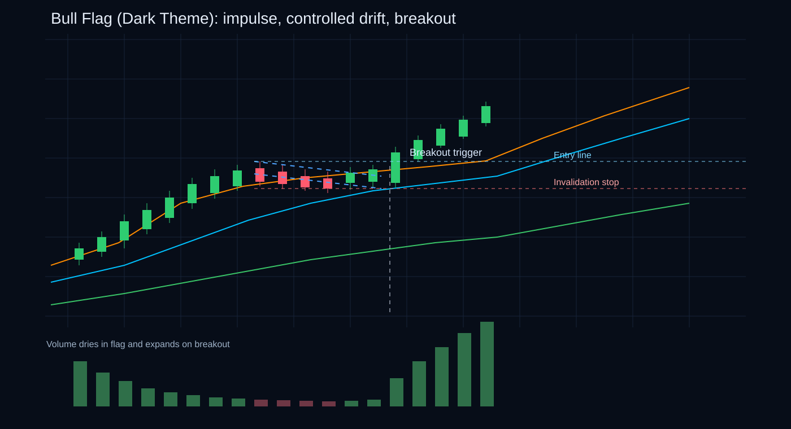
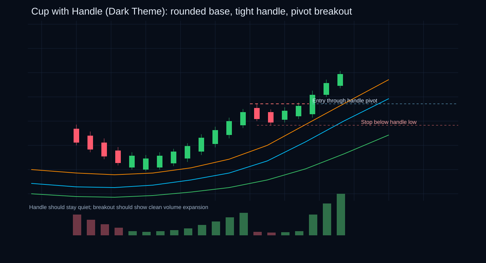
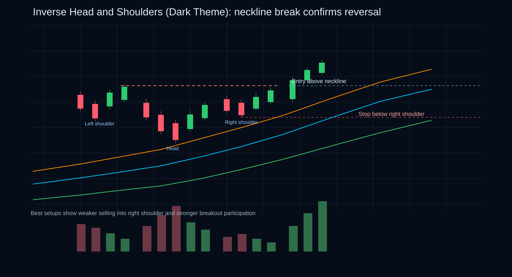
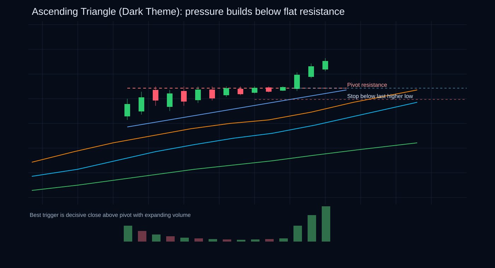
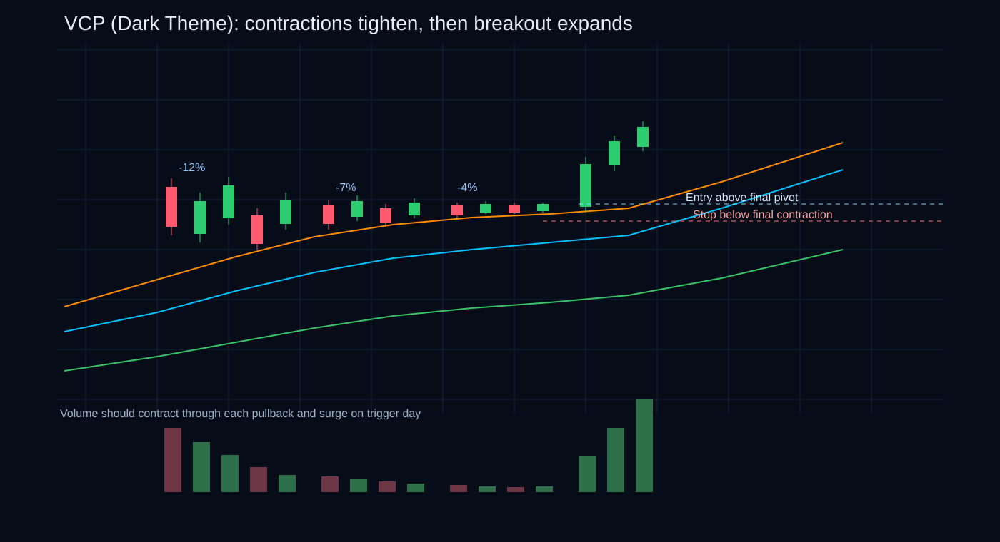
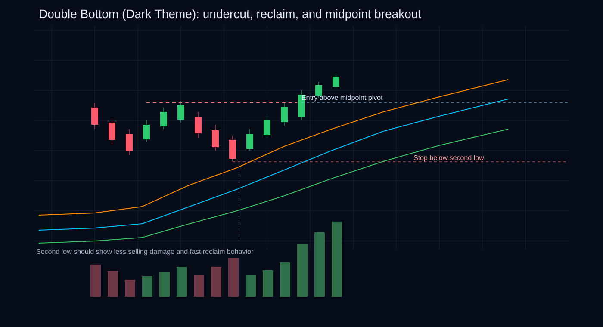
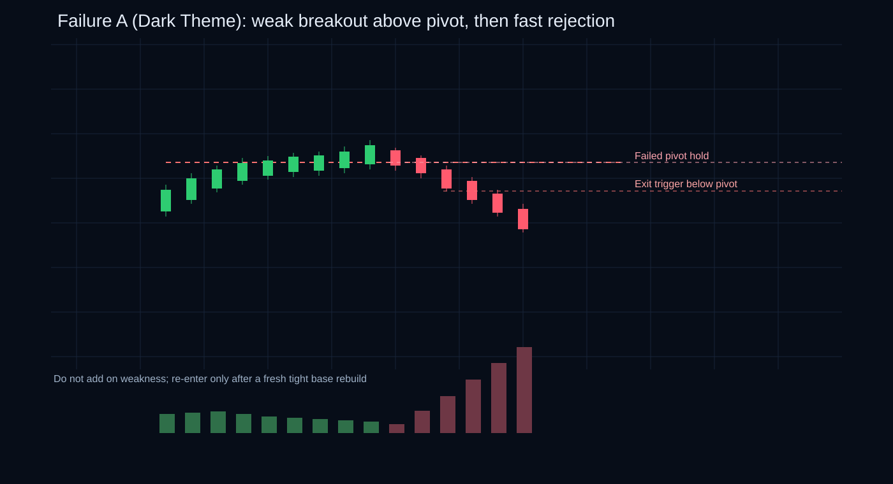
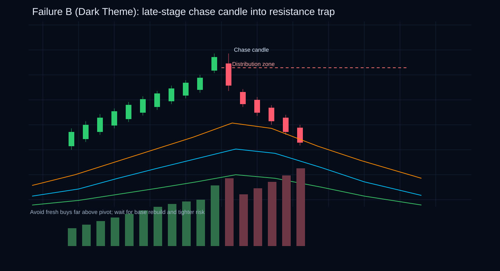
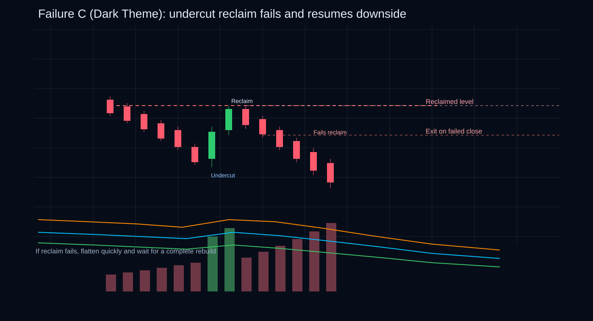

# Chart Patterns & Trade Plans — The Daily Price Action + Volume Playbook

## The Pattern Collector's Mistake

Every beginner trader makes the same mistake.

They download a 200 candle chart with 15 indicators. They draw trendlines. They label Bull Flags and Pennants and Cup-and-Handles. They see patterns everywhere.

And then they trade them.

Half the patterns don't work. The ones that "work" only go their direction for two days before reversing. They're constantly caught on the wrong side of moves, blaming the chart for "breaking" the pattern.

Here's the truth: **The pattern isn't broken. The trade plan is.**

Most traders confuse **pattern recognition** with **trade execution**. They're not the same thing.

A beautiful pattern without an entry plan, a defined stop, a defined risk size, a defined invalidation level, and actual probability analysis is not a setup.

**It's a drawing.**

> *"Price is the final opinion. Volume is the footprint behind it."*

This guide is not for pattern collectors. It's for traders who understand that **a pattern is just the first half of the work.** The second half — turning that pattern into a disciplined trade plan — is where the real money lives.

### What This Guide Actually Is

This is a **daily-use execution manual**. Not a pattern encyclopedia. Not a museum of chart shapes.

Before market open, you're going to spend 10 minutes reading one pattern type and one failure pattern. Then you'll mark your watchlist for stocks matching those behaviors. Then you'll trade them — if and only if all the conditions line up.

The goal is not to memorize 50 patterns or become a pattern expert.

**The goal is to understand:**
- What is price actually telling you?
- Where are institutions likely accumulating or distributing?
- What should volume be doing?
- Where does the entry belong?
- Where does the stop belong?
- When is the setup invalid?
- When should you do nothing?

---

## 1. The Core Rule: Pattern First, Trade Plan Second

A beautiful pattern without:
- a defined trigger,
- a defined stop,
- a defined risk size,
- a defined invalidation,
- and a defined target logic,

is not a setup.
It is only a drawing.

Every pattern in this guide should be read through five questions:

1. **What is price doing?**
2. **What is volume doing?**
3. **Where is the actual trigger?**
4. **Where is the trade wrong?**
5. **Is the reward worth the risk?**

If you cannot answer all five, you are not ready to trade it.

---

## Reading Price Action Like You're Reading a Story (Not a Textbook)

Before you even draw a pattern, learn to read the raw price behavior.

### When Stock Strength Shows Up on the Chart

Strong price action looks like this:

The stock makes higher highs and higher lows. Each rally reaches higher than the one before. Each pullback holds above the last support. The closes are tight and near the highs (not near the lows). Pullbacks are shallow and quick — weak hands can't shake out the strong players. When red days appear, they're quickly recovered from. Price respects the short-term moving averages or key pivots, bouncing off them instead of crashing through.

**What this means:** You're looking at a stock where institutions are still accumulating. Weak holders are gone. The path of least resistance is up.

### When Stock Weakness Shows Up on the Chart

Weak price action is the opposite:

The stock makes lower highs after breakout attempts (failed followthrough). Red candles are wide-range and appear near support levels. There's repeated rejection from resistance (price pokes up but gets smashed back down). Most candles close in the lower half of their range — not a sign of strength. Bounces happen on weak, thin volume. Volatility expands without actual progress in any direction.

**What this means:** Institutions are leaving. Weak buyers keep trying to start moves but get overwhelmed. The path of least resistance is down or sideways.

### Why Tightness Before a Breakout Matters

Here's an insight most traders miss: **Tight trading before a breakout is often more powerful than dramatic movement.**

Why? Because tightness (small candles, narrow range) usually means:

- Supply is drying up (sellers have mostly given up at these levels)
- Weak holders are gone (they exited during the base)
- Institutions are not rushing to sell (if they were, there would be big range candles and breakdowns)
- The next move can expand quickly once demand arrives

When you see price coiling tighter and tighter into a smaller and smaller range, your radar should light up. That's often the moment before a big acceleration.

---

## Reading Volume: The Institutional Fingerprints

Volume tells you something the price chart alone can't: **whether institutions are actually participating or just retail is moving the needle.**

### What Healthy Volume Looks Like

In a proper setup:
- Volume dries up during the base or pullback (weak holders are leaving quietly, strong holders are holding)
- Volume explodes on bullish breakouts (institutions are buying)
- Down-volume stays lower than up-volume during consolidation (selling is happening, but not dominating)
- Support bounces happen with rising participation (demand is real, not desperate)
- The breakout day closes strong *with* visible volume confirmation

**What this means:** The setup has institutional support. This isn't retail chasing. This is the smart money backing the move.

### What Dangerous Volume Looks Like

When you see this, skip the trade:

- Breakout happens on weak volume (no one important is buying)
- Pullbacks happen on rising heavy volume (smart money is taking profits or exiting)
- Price moves up but volume shrinks each day (wrong kind of demand — weak hands buying, not institutions)
- Repeated heavy red candles inside the base (selling is aggressive, not passive)
- Failed breakout is followed by the single largest volume in the entire pattern (capitulation selling, or institutions dumping)

**What this means:** This isn't a real institutional move. This is either a false breakout or people selling into enthusiasm. Dangerous. Skip it.

### The Classic Accumulation Signature

The best patterns almost always show this sequence:

1. **Quiet pullback volume** during the consolidation (weak hands leaving, strong hands just sitting)
2. **Tight price structure** as volatility contracts (supply is drying up)
3. **Aggressive expansion on breakout** (institutions finally starting to buy)

This is the classic signature of accumulation. When you see it, you've found a pattern worth trading.

---

## 4. Universal Pattern Checklist

Before taking any pattern, check all of these:

- [ ] Is the broader market supportive?
- [ ] Is the stock in a Stage 2 / primary uptrend if going long?
- [ ] Is relative strength strong?
- [ ] Is the pattern clean and obvious, not forced?
- [ ] Has volume contracted during the setup?
- [ ] Is there a clear breakout / trigger point?
- [ ] Is the stop placement logical and tight enough?
- [ ] Is risk-reward at least acceptable?
- [ ] Am I buying early strength or chasing extension?
- [ ] If this fails, will I exit without hesitation?

If three or more answers are weak, skip the trade.

---

## 5. Continuation Patterns — The Money Patterns

These patterns work best when the stock is already strong.

### Practical examples (candles + price + volume)
- **Bull Flag example:** stock runs from 420 to 462 in 5 sessions with 1.8x average volume, then pulls back to 452 over 4 small red candles with lower volume each day; trigger is a break above 462 with a strong close near high and volume above the flag-day average.
- **Pennant example:** after a sharp move from 980 to 1,045, candles compress into higher lows (1,012, 1,020, 1,028) and lower highs (1,042, 1,038, 1,034) while volume dries up; breakout above 1,045 should print expansion volume and hold above the broken trendline.
- **Ascending Triangle example:** resistance stays near 765 while lows rise from 731 to 742 to 751 with repeated upper-level tests; valid breakout candle closes above 765 with wider range and visibly higher turnover than prior 5-10 sessions.
- **High Tight Flag example:** stock surges from 210 to 405 in 6 weeks on very high volume, then forms a tight 5-8 session shelf between 386 and 402 on quiet volume; continuation trigger is a decisive move through 405 with fresh participation, not a weak drift.

---

## 5.1 Bull Flag

### Structure
A strong impulse move higher (the pole), followed by a short downward or sideways pause (the flag), followed by continuation.

### Price action signature
- strong sharp advance,
- controlled pullback rather than collapse,
- pullback stays orderly,
- breakout occurs before the structure gets too long and sloppy.

### Volume signature
- high volume on the pole,
- lower volume during the flag,
- renewed volume expansion on breakout.

### Entry plan
- buy on break of the flag high,
- or buy on break of the upper trendline if structure is clear,
- aggressive traders may buy near lower half of flag only if broader context is excellent.

### Stop placement
- below flag low,
- or below last tight pivot inside the flag,
- or ATR-adjusted if the stock is high volatility.

### Target logic
- first target: prior measured range,
- main target: measured move from pole projected upward,
- partials can be taken into strength if the stock becomes extended quickly.

### Invalidation
- heavy-volume breakdown through the lower flag,
- breakout fails and closes back inside flag,
- pullback becomes too deep and starts looking like distribution.

### Variations
- **tight bull flag** — higher quality,
- **shallow flag** — strongest,
- **sideways flag** — excellent if volume dries up,
- **deep flag** — lower quality, needs caution.

---

## 5.2 Pennant / Symmetrical Triangle Continuation

### Structure
After a directional impulse, price coils into converging trendlines.

### Price action signature
- lower highs and higher lows,
- compressing range,
- price energy building,
- continuation bias if trend before the pattern was strong.

### Volume signature
- steady dry-up as triangle narrows,
- breakout should expand with conviction.

### Entry plan
- buy on break above the upper boundary,
- conservative entry: wait for close above triangle plus follow-through,
- aggressive entry: early inside the coil near support only if risk is very tight.

### Stop placement
- below last higher low inside the triangle,
- or below triangle low for wider swing stop.

### Target logic
- measured move from widest part of triangle,
- or prior impulse extension.

### Invalidation
- breakout with no follow-through,
- downside break on heavy volume,
- pattern drifts too long and loses energy.

### Variations
- **symmetrical triangle** — neutral until break,
- **bull pennant** — smaller/tighter version with continuation bias,
- **expanding triangle** — generally lower quality, more emotional and less controlled.

---

## 5.3 Ascending Triangle

### Structure
Flat resistance on top, rising lows underneath.

### Price action signature
- each dip gets bought earlier,
- sellers keep defending one level,
- pressure builds into resistance.

### Volume signature
- often dries up as price presses higher,
- breakout should show obvious participation.

### Entry plan
- buy the breakout above horizontal resistance,
- aggressive traders can enter near support line if price action stays tight.

### Stop placement
- below the last rising swing low,
- or below trendline support if structure is clean.

### Target logic
- measure height of the triangle and project upward,
- or use next resistance zone.

### Invalidation
- decisive break below rising support,
- repeated failed breakout attempts,
- resistance rejection on heavy volume.

### Variations
- **tight ascending triangle** — very powerful,
- **multiple resistance taps** — valid if support keeps rising,
- **too many failed touches** — often weakening, not strengthening.

---

## 5.4 High Tight Flag

### Structure
A nearly vertical move (often 90% to 100%+) followed by a tight shallow rest.

### Why it matters
This is one of the rarest and most explosive continuation patterns.

### Price action signature
- massive prior run,
- unusually tight post-run pause,
- no meaningful giveback,
- price acts like institutions refuse to distribute.

### Volume signature
- huge participation on the run,
- major contraction during the pause,
- renewed expansion on breakout.

### Entry plan
- breakout above flag high,
- no chasing if the breakout gaps too far above a logical stop.

### Stop placement
- below lower end of flag,
- or below the tightest pivot in the pause.

### Target logic
- partials into expansion,
- then trail — these can become monster moves if market regime is strong.

### Invalidation
- breakdown through flag low,
- wide, sloppy ranges appear during pause,
- volume spikes on red bars inside the flag.

### Variations
- **classic HTF** — strongest,
- **mini high-tight flag** — useful but lower magnitude,
- **false HTF** — too deep a pullback; no longer a real HTF.

---

## 6. Base Patterns — Structured Breakout Setups

These are the patterns most traders should specialize in.

### Practical examples (candles + price + volume)
- **Cup with Handle example:** stock declines from 1,120 to 940 and rounds back to 1,105 over several weeks, then forms a handle between 1,070 and 1,100 with small candle bodies; breakout above 1,100 should close strong with clear volume expansion versus handle days.
- **Flat Base example:** after a prior up-leg, stock moves sideways between 522 and 545 for 4 weeks with tight closes and shrinking daily range; trigger is a close above 545 on a wide bullish candle and participation that stands out versus the base average.
- **Double Bottom example:** first low prints near 288, rebound reaches midpoint 324, second low undercuts to 282 and quickly reclaims 288; confirmation is a break above 324 with stronger volume than the rebound leg.
- **VCP example:** pullbacks contract from 12% to 8% to 4% (for example, 640 to 563, then 622 to 572, then 610 to 586) while volume fades each contraction; entry is through the final pivot near 610 with urgent breakout volume.

---

## 6.1 Cup with Handle

### Structure
Rounded cup, then a short light handle in the upper half/upper third.

### Price action signature
- rounded base instead of jagged collapse,
- right side builds constructively,
- handle drifts down calmly,
- breakout happens from a strong position near highs.

### Volume signature
- lower volume near bottom of cup,
- improving volume on right side advance,
- dry volume in the handle,
- breakout day should show real demand.

### Entry plan
- buy above the handle high / pivot,
- avoid buying too low inside the cup unless you have a separate early-entry system.

### Stop placement
- below handle low,
- or below breakout candle low if very tight,
- or 7–8% style stop for position trading depending on framework.

### Target logic
- measured move from cup depth,
- prior resistance zones,
- partial at 2R / 3R and trail balance.

### Invalidation
- handle breaks down on volume,
- breakout fails and closes back below pivot,
- cup is too deep and loose.

### Variations
- **classic cup with handle** — highest quality,
- **cup without handle** — can work, but breakout often more volatile,
- **deep cup** — lower quality unless market context supports it,
- **V-shaped cup** — lower quality than a rounded U.

---

## 6.2 Flat Base

### Structure
A relatively shallow sideways consolidation after an advance.

### Price action signature
- tight range,
- repeated support holds,
- no deep retracement,
- efficient rest after prior move.

### Volume signature
- declining volume throughout the base,
- breakout volume should stand out clearly.

### Entry plan
- buy on break of the flat top / pivot,
- or buy a pullback after breakout to pivot if one appears cleanly.

### Stop placement
- below the lower end of the flat base,
- or below most recent support pivot.

### Target logic
- next expansion leg,
- measured from prior impulse,
- use trend continuation rather than rigid capped targets.

### Invalidation
- deep crack through the base,
- failed breakout on volume,
- multiple upper wicks showing distribution.

### Variations
- **first-stage flat base** — good,
- **second-stage flat base** — often excellent,
- **late-stage flat base** — more failure-prone.

---

## 6.3 Double Bottom

### Structure
W-shaped base where second low often undercuts first low to shake out weak hands.

### Price action signature
- first decline stabilizes,
- recovery to midpoint,
- second decline undercuts or matches prior low,
- price quickly reclaims support and moves toward midpoint.

### Volume signature
- second low ideally comes on less destructive volume,
- breakout through midpoint should expand strongly.

### Entry plan
- buy through the midpoint pivot,
- aggressive traders may buy reversal off second low only if there is very strong confirmation.

### Stop placement
- below second low,
- or below reversal candle at second low for aggressive entry.

### Target logic
- base height projection,
- next resistance zone.

### Invalidation
- second low keeps breaking without reclaim,
- midpoint breakout fails immediately,
- structure becomes messy and wide.

### Variations
- **clean W** — strongest,
- **undercut-and-reclaim** — very powerful,
- **equal lows** — acceptable,
- **triple bottom** — can work but often slower and more failure-prone if too obvious.

---

## 6.4 Volatility Contraction Pattern (VCP)

### Structure
A series of pullbacks where each contraction becomes smaller than the previous one.

### Price action signature
- pullbacks go from wide to tight,
- volatility visibly contracts,
- price starts to trade in a very small range near highs,
- supply appears exhausted.

### Volume signature
- volume drops with each contraction,
- final contraction often feels unusually quiet,
- breakout should expand sharply.

### Entry plan
- buy through pivot above the final tight contraction,
- or on a pocket-pivot style thrust if your framework supports early entry.

### Stop placement
- below final contraction low,
- or below the nearest tight pivot.

### Target logic
- often best traded with trailing logic,
- first target at 2R / 3R,
- then trail under higher lows or moving average.

### Invalidation
- contraction widens instead of tightens,
- volume expands on downside inside the pattern,
- breakout lacks urgency.

### Variations
- **2-contraction VCP** — acceptable,
- **3-contraction VCP** — classic,
- **4-contraction VCP** — excellent if still tight,
- **too many contractions** — may lose power and become over-observed.

---

## 7. Reversal Patterns — Trade Smaller, Trade Cleaner

Reversal patterns can work well, but they generally demand more patience and more selectivity.

### Practical examples (candles + price + volume)
- **Inverse H&S example:** left shoulder forms near 410, head near 382, right shoulder near 398, with neckline around 432; stronger setup shows fewer wide red candles on the right shoulder and a neckline breakout candle that closes near its high with improved volume.
- **Rounding Bottom example:** stock trends down from 760 to 590, spends weeks stabilizing with smaller candle spreads, then climbs back toward 740; breakout above 740 is stronger when volume gradually improves into the breakout rather than spiking only on one day.
- **Undercut & Reclaim example:** support at 250 breaks intraday to 242 on a flush, but price closes back above 250 with a long lower wick and higher relative volume; confirmation is follow-through above the reclaim candle high, and failure is a close back below 250.

---

## 7.1 Inverse Head and Shoulders

### Structure
Three troughs, with the middle low deeper than the other two, followed by neckline breakout.

### Price action signature
- selling pressure weakens into right shoulder,
- reclaim attempts start holding,
- price compresses under neckline before release.

### Volume signature
- volume often highest near capitulation low,
- breakout above neckline should attract clear participation.

### Entry plan
- buy neckline breakout,
- or buy neckline retest if it occurs constructively.

### Stop placement
- below right shoulder low,
- or below neckline retest low.

### Target logic
- head-to-neckline distance projected upward.

### Invalidation
- neckline breakout fails,
- right shoulder breaks down,
- weak volume on all reclaim attempts.

---

## 7.2 Rounding Bottom / Saucer

### Structure
A slow transition from decline to accumulation to breakout.

### Price action signature
- gradual flattening of trend,
- no violent rejection at the lows,
- slow institutional accumulation feel,
- breakout from long range can start major trend.

### Volume signature
- often quiet at the bottom,
- improves gradually as price turns up,
- breakout should still show expansion.

### Entry plan
- buy on break of the saucer pivot,
- or buy first constructive pullback after breakout.

### Stop placement
- below breakout level,
- or below last higher low.

### Target logic
- measured move from depth of structure,
- or multi-month swing hold if broader trend is changing.

### Invalidation
- breakout fails and sinks back into base,
- structure is too loose and erratic.

---

## 7.3 Failed Breakdown / Undercut & Reclaim

### Structure
Price breaks support, traps weak holders and shorts, then snaps back above the level.

### Price action signature
- sharp reclaim after undercut,
- closes back above key level,
- trap energy often fuels the next move.

### Volume signature
- can show climactic volume at the undercut,
- reclaim day often improves significantly.

### Entry plan
- buy on reclaim close or next confirmation bar,
- especially strong when reclaim happens at prior major low or base low.

### Stop placement
- below reclaim low.

### Target logic
- first target at midpoint of the range,
- second target at prior resistance.

### Invalidation
- reclaim fails immediately,
- price closes back below reclaimed level.

---

## 8. Intraday Patterns Worth Keeping Simple

For daily review, these are enough.

### 8.1 Opening Range Breakout (ORB)
- define the first 5 / 15 / 30-minute range,
- trade break with volume and market alignment,
- best on gap + news + RS names.

### 8.2 First Pullback After Breakout
- stock breaks out strongly,
- then gives first clean pullback to VWAP / 9 EMA / pivot,
- continuation often cleaner than chasing initial burst.

### 8.3 Inside Bar Break
- small compression after an impulse,
- break of inside-bar high or low gives low-risk continuation or reversal trigger.

These should still be traded with the same logic:
entry, stop, target, invalidation, and no emotional improvisation.

---

## 9. Pattern Failure Signs — What to Watch Every Day

These signs matter more than the pattern label.

A setup is weaker when:
- breakout volume is below average,
- price closes weak on breakout day,
- follow-through disappears immediately,
- red candles inside the setup expand in range and volume,
- the stock is already extended from the pivot,
- market index is under pressure,
- leadership is deteriorating,
- the pattern is too obvious and too late in trend stage.

A professional trader must be as skilled at reading **failed patterns** as successful ones.

Because often the best loss prevention happens before entry.

---

## 10. Trade Plan Templates by Pattern

Use this exact structure.

Tip: model your notes after the practical examples in Sections 5, 6, and 7 so each plan includes concrete candle behavior, price levels, and volume expectations.

### Template A — Breakout Trade
- **Pattern:**
- **Trend context:**
- **Pivot / trigger:**
- **Entry price:**
- **Stop location:**
- **Risk per share:**
- **Position size:**
- **First target:**
- **Main target / trail logic:**
- **Invalidation condition:**
- **What volume must do:**

### Template B — Pullback Trade
- **Pattern that broke out from:**
- **Pullback level:**
- **What confirms support:**
- **Bounce trigger:**
- **Stop:**
- **Target:**
- **Invalidation:**

### Template C — Reversal Trade
- **Major level being defended:**
- **What shows sellers are exhausted:**
- **What confirms reclaim:**
- **Entry:**
- **Stop:**
- **Target:**
- **Why this is not just a random bounce:**

---

## 11. Daily Pattern Review Routine

### Before market open
Look for:
- stocks near pivots,
- bases with drying volume,
- bull flags after strong earnings moves,
- tight handles,
- VCP-like contractions,
- clean support retests,
- relative strength leaders.

### During market hours
Focus only on:
- price at level,
- volume relative to average,
- quality of breakout candle,
- whether the setup is extending too far from risk.

### After market close
Review:
- which breakouts worked,
- which failed,
- whether volume confirmed,
- whether your entry was early, clean, or emotional,
- whether you respected the actual trade plan.

This is how patterns stop being theory and become intuition.

---

## 12. The Daily “No Trade” List

Do **not** trade the pattern when:
- the market is weak and the stock is trying to fight alone,
- volume is missing,
- the entry is too extended,
- stop placement is too wide,
- structure is loose and obvious in a bad way,
- you are emotionally urgent,
- you are taking the trade because the pattern looks pretty but the plan is weak.

Beautiful charts do not pay.
Well-executed trade plans do.

---

## 13. Visual Pattern Examples Drill (Candles + Structure + Volume + Trade Plan)

Use this as a **10-minute daily rehearsal** before market open.
Read each pattern once, then mark watchlist names that match the same behavior.

### 13.0 Quick Visual Index (Dark Theme)

| Continuation | Base Pattern | Reversal Pattern |
|---|---|---|
|  |  |  |
|  |  |  |
|  |  |  |

**How to use the grid:** pick one setup from row 1/2 for offense and one failure from row 3 for defense before the open.

### 13.1 Bull Flag (Continuation)

- **Candles:** 4-8 candle pullback, small real bodies, limited upper-wick rejection.
- **Price structure:** strong impulse, then orderly downward/sideways channel above key support.
- **Volume behavior:** high on impulse, dry-up during flag, expansion on breakout candle.
- **Trade plan:** buy above flag high; stop below flag low; first target 2R or prior swing extension; invalidate on heavy close back inside flag.
- **Variation action map:** aggressive = early inside flag near support after reclaim; standard = breakout close above flag high; conservative = breakout + next-day hold/retest; avoid = deep flag with rising sell volume.

### 13.2 Ascending Triangle (Continuation)

- **Candles:** repeated tests near resistance with tighter pullbacks.
- **Price structure:** flat top + rising lows, pressure builds into pivot.
- **Volume behavior:** generally contracts into apex, expands at resistance break.
- **Trade plan:** enter on decisive close above resistance; stop below last higher low; target measured triangle height; invalidate on breakdown below rising trendline.
- **Variation action map:** aggressive = buy near rising trendline after bullish reversal candle; standard = breakout through flat top with expansion volume; conservative = wait for breakout retest hold; avoid = too many failed top-side breaks with heavy upper wicks.

### 13.3 Cup with Handle (Base Breakout)

- **Candles:** rounded base candles, then short handle with calm drift.
- **Price structure:** U-shaped recovery, handle in upper half, pivot near prior highs.
- **Volume behavior:** quiet near cup bottom, improves on right side, dries in handle, surges on pivot break.
- **Trade plan:** buy through handle high; stop below handle low; partial at 2R then trail; invalidate if breakout closes back below pivot.
- **Variation action map:** aggressive = tight handle support bounce with very small risk; standard = pivot breakout through handle high; conservative = breakout plus follow-through day; avoid = deep/loose handle with repeated distribution bars.

### 13.4 Volatility Contraction Pattern (VCP)

- **Candles:** pullbacks shrink in depth/range (for example, 10% -> 6% -> 3%).
- **Price structure:** progressively tighter swings near highs, supply-exhaustion feel.
- **Volume behavior:** contracts with each pullback, breakout should show urgency.
- **Trade plan:** enter through final tight pivot; stop below last contraction low; target 2R/3R then trail; invalidate if volatility expands down before breakout.
- **Variation action map:** aggressive = pocket-pivot style thrust before final pivot; standard = clear break of final contraction pivot; conservative = breakout hold and first tight inside-day continuation; avoid = contraction sequence widens or downside range expands.

### 13.5 Double Bottom (Reversal to Breakout)

- **Candles:** first low bounce, second low undercut/reclaim candle preferred.
- **Price structure:** W-shape with midpoint pivot as trigger.
- **Volume behavior:** selling pressure lighter on second leg, stronger volume through midpoint.
- **Trade plan:** buy above midpoint pivot; stop below second low; target base-height projection; invalidate on failed midpoint breakout.
- **Variation action map:** aggressive = buy undercut-and-reclaim candle close with tight stop; standard = midpoint pivot breakout entry; conservative = breakout + pullback hold above midpoint; avoid = second low breaks and fails to reclaim quickly.

### 13.6 Inverse Head and Shoulders (Reversal)

- **Candles:** left shoulder, deeper head, higher-quality right shoulder with less spread.
- **Price structure:** neckline defines trigger; right shoulder should hold cleaner.
- **Volume behavior:** capitulation near head, participation rises on neckline break.
- **Trade plan:** buy neckline breakout/retest hold; stop below right shoulder; target head-to-neckline projection; invalidate if price loses neckline quickly.
- **Variation action map:** aggressive = right-shoulder reversal candle near support; standard = neckline breakout with volume; conservative = neckline retest hold; avoid = right shoulder forms with expanding red range and weak closes.

### 13.7 Failure Drill A - Weak-Volume Breakout Failure

- **Candles:** breakout candle closes off highs, next day inside/down close.
- **Price structure:** brief pivot break with no range expansion follow-through.
- **Volume behavior:** breakout volume below pattern average.
- **Trade plan:** avoid new entry; if already in, cut on close back below pivot; no re-entry until fresh tight setup appears.
- **Variation action map:** act now = exit on failed close below pivot; re-entry = only after new tight base with real volume; avoid = averaging down while price remains under failed pivot.

### 13.8 Failure Drill B - Late-Stage Extended Breakout Trap

- **Candles:** wide green candle into resistance after multi-leg run, long upper wick appears.
- **Price structure:** breakout attempt occurs far above logical support/risk point.
- **Volume behavior:** high volume but poor close quality (distribution risk).
- **Trade plan:** do not chase; wait for constructive pullback; invalidate bull case on follow-through red expansion.
- **Variation action map:** act now = skip the chase and protect open gains; re-entry = first tight pullback to support with calm volume; avoid = fresh buys 4-8% above pivot into resistance.

### 13.9 Failure Drill C - Undercut Reclaim That Fails

- **Candles:** reclaim candle prints, then next session closes back below reclaimed level.
- **Price structure:** failed trap reversal, support flips back to resistance.
- **Volume behavior:** reclaim is not supported by sustained demand.
- **Trade plan:** exit immediately on failed reclaim close; stand aside until base rebuilds; bearish bias is valid below failed level.
- **Variation action map:** act now = close position on failed reclaim close; re-entry = only after a second valid reclaim plus follow-through; avoid = holding because of the first reclaim narrative.

Use this drill daily:
- **Pre-open:** mark watchlist names matching one to two live structures.
- **Intraday:** trade only if price + volume match the drill.
- **Post-close:** score execution quality, not just P&L.

---

## 14. The One-Page Summary

### Best continuation patterns
- Bull flag
- Pennant
- Ascending triangle
- High tight flag
- VCP

### Best structured base patterns
- Cup with handle
- Flat base
- Double bottom

### Best reversal patterns
- Inverse H&S
- Rounding bottom
- Undercut & reclaim

### What price should do
- stay tight,
- pull back orderly,
- reclaim quickly,
- close strong,
- hold pivots.

### What volume should do
- dry up in the pattern,
- expand on breakout,
- stay lower on pullbacks,
- avoid heavy red distribution inside the setup.

### Entry logic
- buy at the actual trigger,
- not in the middle of nowhere,
- not after emotional extension.

### Stop logic
- place stop where the idea is invalid,
- not where it merely feels uncomfortable.

### Target logic
- use measured moves,
- resistance zones,
- or trailing logic when trend is strong.

### Final rule
> **If the pattern is clear but the trade plan is weak, pass.**

A professional is not paid for spotting patterns.
A professional is paid for executing them correctly.

---

*— End of Chart Patterns & Trade Plans —*

